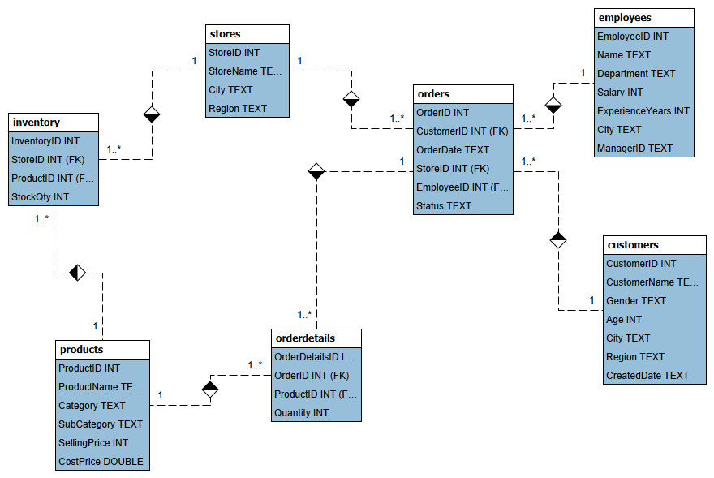

# Retail_analysis

# 🏪 End-to-End Retail Performance Analytics Portfolio

## 📦 1. The Dataset Explained
This project utilizes a multi-table relational retail dataset consisting of seven interconnected tables mapping out complete business operations:
*   **`orderdetails` (Fact Table):** The core transactional hub containing individual line items, ordered quantities, product IDs, and associated order IDs.
*   **`orders`:** Tracks individual customer transactions, order dates, and the employee responsible for processing the sale.
*   **`products`:** Contains product names, categories, store inventory IDs, and pricing metrics (`SellingPrice` vs. `CostPrice`).
*   **`stores`:** Profiles the physical storefront locations generating the revenue streams.
*   **`employees`:** Contains staff profiles, names, and internal identifier keys tracking workplace output.
*   **`customers` & `inventory`:** Lookup tables containing unique customer profiles and current stock configurations.

---

## ⚠️ 2. The Data Problems Faced
As a data analyst handling this project, I encountered several structural and data-quality hurdles that had to be resolved before any business insights could be generated:

1.  **Data Type Mismatches & Broken Visualizations:** During the initial dataset structure evaluation, key relational fields (like `OrderID` and `ProductID`) were incorrectly identified as general `TEXT` or `VARCHAR` fields instead of numerical integers (`INT`). This mismatch completely blocked MySQL Workbench from recognizing the relationships, rendering the EER visual schema diagram broken and unconnected.
2.  **Risk of Orphaned Records:** The raw data lacked structural guardrails. Without formal relational constraints, the database was vulnerable to data corruption—such as log details being created for products or orders that did not officially exist.
3.  **Data Quality & Duplicate Vulnerability:** Raw transaction data frequently carries duplicate keys or mismatched structural counts which distort final KPI aggregations if left unverified.

---

## 🛠️ 3. How We Solved It (Technical Execution)
To fix these engineering bottlenecks and ensure absolute data integrity, I implemented a strict data cleaning and optimization workflow:

*   **Standardizing Column Languages:** I executed explicit database modification queries (`ALTER TABLE ... MODIFY COLUMN`) to convert text-based ID columns into matching standard `INT` configurations.
*   **Enforcing Relational Guardrails:** I applied formal database restrictions (`ADD CONSTRAINT ... FOREIGN KEY`) to firmly link `orderdetails` to both the primary `orders` and `products` tables. This forced the visual schema layout lines to automatically snap into place, ensuring structural continuity.
*   **Data Integrity Auditing:** I built diagnostic validation routines using structural description tools (`DESCRIBE`) and targeted deduplication checks (`GROUP BY ... HAVING COUNT(*) > 1`) across core tables like `customers` and `employees` to verify a perfectly clean environment.

---

## 📊 4. What We Found (Business Insights Extracted)
With a clean database architecture in place, I executed comprehensive business intelligence frameworks to pull deep operational value across four corporate dimensions:

*   **Executive Financial Health:** isolated absolute transaction volume, total revenue generation, net operational profits, and precise profit margin percentages using dynamic mathematical rounding algorithms.
*   **Time-Series Growth Trends:** Utilized date-formatting algorithms (`DATE_FORMAT`) to reconstruct historical, month-over-month performance trends, identifying chronological growth peaks and off-season shifts.
*   **Inventory Velocity & Dead Stock:** Ranked the top 10 most profitable individual products and high-level retail categories. Crucially, I deployed exclusionary lookup filters (`LEFT JOIN ... WHERE ... IS NULL`) to expose absolute "Dead Stock"—inventory items taking up physical warehouse shelf space without ever generating a single sale.
*   **Workforce & Location Benchmarking:** Aggregated multi-table datasets across four dimensions to rank physical retail locations by gross revenue performance. Additionally, I implemented staff productivity tracking arrays (`LIMIT 10`) to identify and reward the top 10 most productive sales associates based on lifetime sales volume.
